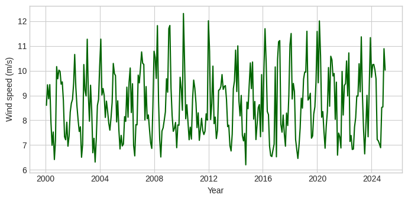

## Construction of the Wind Extreme Indicator

### Purpose and Data
To capture the physical risk associated with windstorms, we construct an indicator of extreme wind intensity using daily meteorological data from the **SAFRAN reanalysis** produced by Météo-France. The SAFRAN dataset provides gridded atmospheric variables over metropolitan France at an approximate spatial resolution of 8 km and at a daily frequency.

We use the variable corresponding to the **daily maximum wind speed** measured at 10 meters above ground level, expressed in meters per second ($m/s$). Let $W_t$ denote the daily maximum wind speed at time $t$ for a given grid cell.

---

### Methodology

#### Step 1: Monthly Aggregation
Because the economic scenario generator operates at a monthly frequency, the daily data are aggregated to the monthly level. For each calendar month $m$, we define the wind extreme indicator as the maximum daily wind speed observed during that month:

$$
WindExtreme_m = \max_{t \in m} W_t
$$

This transformation allows us to retain information on extreme wind events while ensuring consistency with the time scale used in the economic scenario generator.

#### Step 2: National Averaging
The indicator is first computed for each SAFRAN grid cell and then averaged across all grid points covering metropolitan France in order to obtain a national-level time series:

$$
WindExtreme_m = \frac{1}{N} \sum_{i=1}^{N} WindExtreme_{m,i}
$$

where:
* $i$ indexes the grid cells.
* $N$ denotes the total number of grid points over France.

---

### Visual Evolution
Below is the monthly evolution of the Wind Extreme index aggregated over France.

**Monthly Wind Extreme Index for France (2000–2024)**

*Figure: Time series of the Wind Extreme indicator (m/s) showing the maximum daily wind speed per month averaged over metropolitan France.*

---

### Final Indicator
The final series represents the monthly intensity of extreme wind events at the national scale and is used as a proxy for storm-related physical risk in the economic scenario generator.
