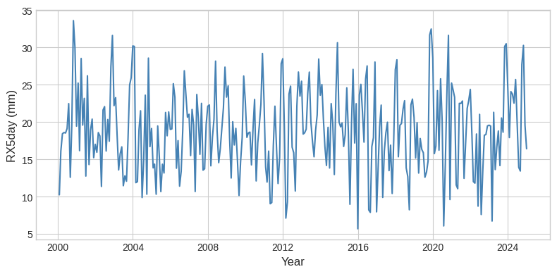

## Construction of the Extreme Precipitation Indicator (RX5day)

### Purpose
To capture the physical risk associated with intense precipitation events that may lead to flooding, we construct the **RX5day indicator**, a widely used climate extreme index defined by the Expert Team on Climate Change Detection and Indices (ETCCDI). This index measures the maximum cumulative precipitation occurring over five consecutive days within a given period.

---

### Data
Daily precipitation data are obtained from the **SAFRAN reanalysis dataset** provided by Météo-France. SAFRAN provides gridded meteorological variables over France at a spatial resolution of approximately 8 km. We use daily total precipitation values expressed in millimeters per day.

---

### Methodology

#### Step 1: Rolling accumulation
For each grid cell, we first compute rolling five-day cumulative precipitation totals using daily observations. Formally, for a given day $t$, the five-day precipitation accumulation is defined as:

$$
RX5_t = \sum_{i=0}^{4} P_{t-i}
$$

where $P_t$ denotes daily precipitation.

#### Step 2: Monthly maximum
The RX5day index is then defined as the maximum of these five-day accumulations within each calendar month:

$$
RX5day_m = \max_{t \in m} \left( \sum_{i=0}^{4} P_{t-i} \right)
$$

where $m$ denotes the calendar month.

---

### Aggregation and Interpretation
This procedure yields a monthly time series of extreme precipitation intensity for each grid cell. To obtain a national-level indicator consistent with the macroeconomic scale of our economic scenario generator, we compute the **spatial average of RX5day** across all SAFRAN grid cells covering metropolitan France.

The final indicator therefore represents the monthly maximum precipitation accumulated over five consecutive days, averaged across France. This variable provides a proxy for extreme rainfall events associated with pluvial or fluvial flooding risk.

### Visual Evolution
Below is the monthly evolution of the RX5day index aggregated over France, showing the variability and peaks of extreme 5-day precipitation events.

**Monthly RX5day Index for France (2000–2024)**

*Figure: Time series of the RX5day indicator (mm), showing the maximum 5-day accumulated precipitation per month averaged over metropolitan France.*
