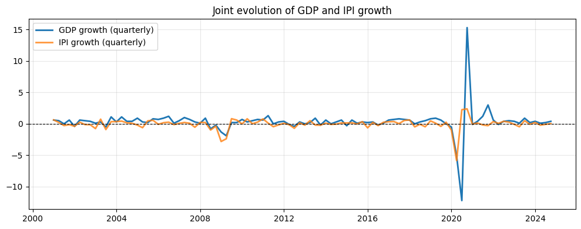

# Justification for Using the Industrial Production Index (IPI) as a Proxy for GDP Growth

The figure below presents the joint evolution of quarterly GDP growth and a quarterly measure of Industrial Production Index (IPI) growth. It highlights a strong co-movement between the two series over the entire sample period. Periods of slowdown and recovery are largely synchronized, and the main turning points in the business cycle occur at similar dates for both GDP and IPI.

Differences in amplitude can be observed, particularly during major macroeconomic shocks. These discrepancies are expected, given the narrower sectoral coverage of the IPI, which focuses on industrial activity, whereas GDP aggregates all sectors of the economy. Nevertheless, despite these differences in magnitude, the temporal dynamics of the two indicators remain closely aligned, indicating that the IPI effectively captures aggregate economic fluctuations.

Moreover, a key argument for using the IPI lies in its ability to measure economic activity outside the primary sector, particularly agriculture, whose output is highly seasonal and directly sensitive to climatic conditions. By focusing on industrial activity, the IPI allows for a clearer identification of cyclical fluctuations driven by macroeconomic and financial shocks, independently of sector-specific variations related to agriculture. This choice is consistent with the objective of the analysis, which aims to study the cyclical dynamics of the economy using an indicator that primarily reflects macroeconomic and financial mechanisms.

Finally, this graphical evidence is consistent with quantitative results showing a positive correlation between quarterly GDP growth and the quarterly growth of the IPI. The IPI is not intended to measure the level of GDP, but rather to provide a relevant approximation of its short-term dynamics. Taken together, these elements justify its use as a proxy for GDP growth in this study.
